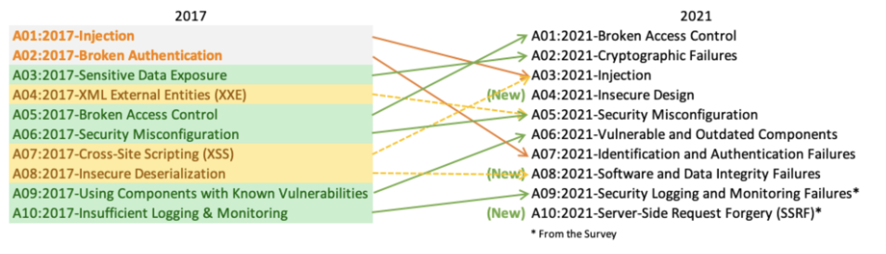

# Clojue Secure Code Guidelines

# Background Info

Presentation about OWASP Top 10. All the texts from the vulnerabilities were extracted from the official document.

[OWASP TOP 10 DOCUMENT](https://owasp.org/www-project-top-ten/)

# What's OWASP
OWASP (Open Web Application Security Project) is an organization that provides unbiased and practical, cost-effective information about computer and Internet applications.

# What's OWASP TOP 10
The OWASP Top 10 is a powerful awareness document for web application security. It represents a broad consensus about the most critical security risks to web applications. Project members include a variety of security experts from around the world who have shared their expertise to produce this list.

# Guidelines

[Broken access control](examples/broken-access-control/README.md)
[Injection](examples/injection/README.md)
[Security misconfiguration](examples/security-misconfiguration/README.md)
[XML external entities](examples/xml-external-entities/README.md)
[Broken authentication](examples/broken-authentication/README.md)
[Insecure deserialization](examples/insecure-deserialization/README.md)
[Sensitive data exposure](examples/sensitive-data-exposure/README.md)
[Cross-site scripting](examples/cross-site-scripting/README.md)
[Insufficient logging and monitoring](examples/insufficient-logging-and-monitoring/README.md)
[Using components with known vulnerabilities](examples/using-components-with-known-vulnerabilities/README.md)
